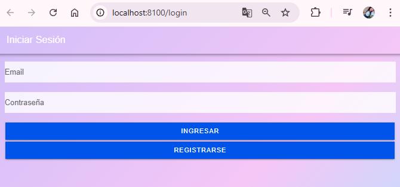
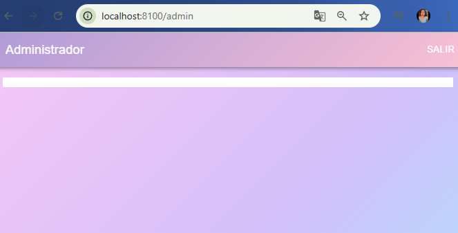
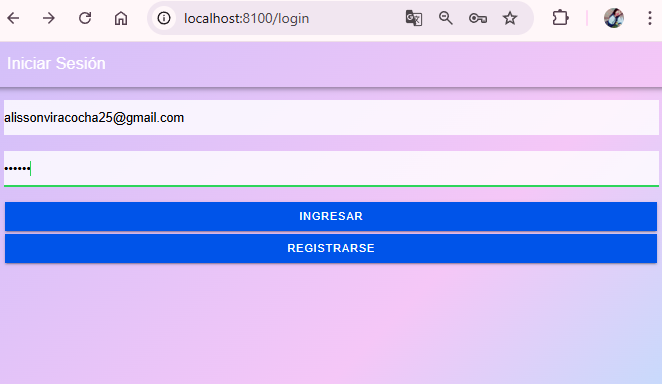
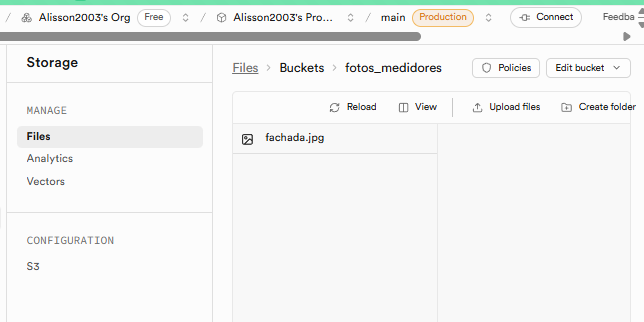
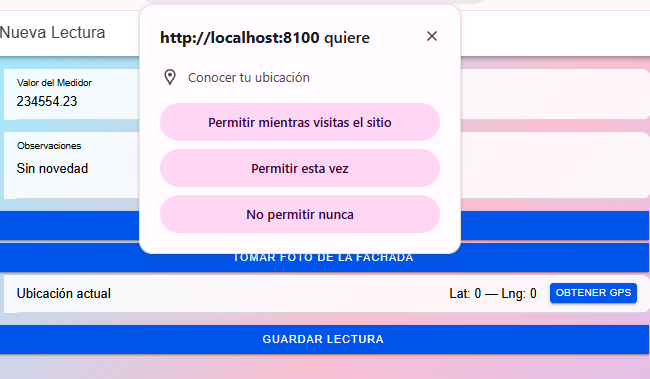
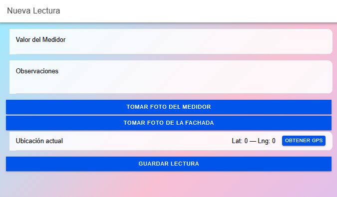
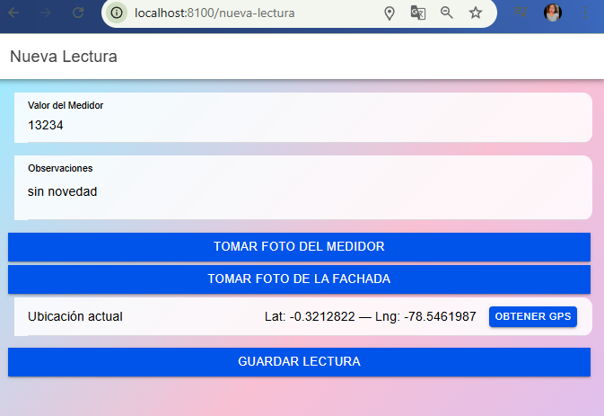
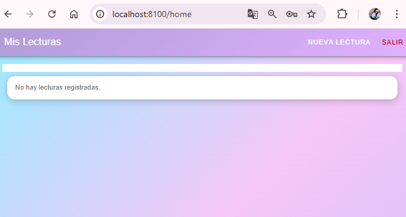

# Aplicación Móvil - Registro de Lecturas de Agua

App en Ionic Angular para registrar medidores de agua
con evidencia fotográfica y geolocalización.

## Funcionalidades

- Login con Supabase

- Roles: 
admin  

medidor

- Captura de foto del medidor
- Captura de foto de fachada

- GPS automático

- Enlace directo a Google Maps
- Subida a Supabase Storage

- Registro en tabla “lecturas”

- Admin ve todas las lecturas
- Medidor ve solo las suyas

## Stack
- Ionic Angular
- Capacitor Camera
- Capacitor Geolocation
- Supabase Auth
- Supabase DB
- Supabase Storage
